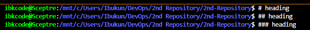

# GIT PROJECT
## PROJECT HIGHLIGHT

1.	Git
2.	Introduction to git
3.	What is git
4.	Importance of git
5.	Targeted Audience
6.	Prerequisite
7.	Goal to be accomplished by the end of the project.

## Git:
Git is an Open - Source Distributed Version Control System.

## Introduction to git:
A lot of word were used to describe GIT, they are -:
•	Control System
•	Version Control System
•	Distributed Version Control System

Now we can take these one by one 
Control system-: This means that git is a content tracker, git can be used to content. In this case git is mostly used to store code.
Version Control system-: The code stored in git keep changing as more code is added. Many developers can add code in parallel. Version control system help keeps the history of what changes.
Distributed Version Control System-: Git has remote repository which is stored in a server and a local computer of each developer. This means that the code is both available on the server as well as developer’s computer
In addition the scope of a project change often. So a vsc allows developers to revert and go back to an older version of the code. 
Finally, sometimes several projects which are being run in parallel involve the same codebase. In such a case, the concept of branching in Git is very important.

## what is Git.
Git is a powerful version control system that is widely used in software development
Git is an open-source programming tool that allows users to effortlessly track the changes made during the early stages of software development. It allows individual programs to keep a record of the changes that they have made to easily restore or back-up earlier versions of their code

### Importance of git
1.	Git is an important tool to anyone into Software development, DevOps Engineer, Developers, project Manager, System Administrator and Site reliability Engineer.
2.	Git gives room for collaboration among teams & software developers
3.	Git maintains a detail changes or modification history. It provides detail of who made the changes, what was change, when was the change made.
4.	Git branch and merging makes it possible for development team to create branches separate from the main codebase to work on a new version of software.
5.	Git allow developer or team to do their part and merge changes after completion.

### Targeted Audience
This application is important to expert in different tech industry
•	Git is widely used by software engineers.
•	Git is used by programmers.
•	Git are used by Project managers.
•	Git are used by instructors.
•	Git are used by coding students
•	Git are used by data scientist and researcher

### Prerequisite
Before learning Git, students should either have a background in coding or a plan to learn coding alongside their Git training. While there is no technical prerequisite to learning how to code to learn Git, without coding knowledge, Git is a useless skill.

•	Learner should have positive mind toward learning a new thing.
•	Learner should have a basic knowledge of Linux command
•	Learner should have access to install Git on their operating system
•	Learner should be able to do text editor.

## Goal to be accomplished by the end of the project
At the end of this project, learner should have gain the confidence and skill to effectively use git in their day to day development activities.
•	Learner should understand the basics of Git, including repositories, commits etc.
•	Learning should efficiently use git command to execute their task

## INTRODUCTION TO GIT

###  Initializing a git Repository
To start initializing git repo, git must have been installed on our machine

Follow below order
1. Open a terminal on the computer e.g Git bash
2. Enter cd DevOps from home.
3. On open terminal create a folder or directory e.g Git_Project with mkdir command {mkdir Git_Project} inside existing DevOps folder.  
4.	On the terminal, press git init for initialization of our repository 

For creating repo

From above screenshot, we have been able to create working directory and initialized git repository. With this we can proceed and make our first commit in git.

Commit means saving any changes made to my file, changes like add, delete and file or text modification
When we make a commit, Git takes a snapshot of the current state of our repository and save a copy in git folder inside our current working directory

### We can create our First commit now follow this order
Inside my working directory, I create a new file called index.txt using touch command

Enter Syntax git touch  {touch index.txt}.

Then inside the index file created input some words on the blank file, then save.
Next step is to add our change git to staging area by using git add command
Enter syntax git add .
To commit the change we made to git, use the git commit -m command “initial commit: -m is a flag to add a commit message that gives us context of commit or hint about commit.

## Working with branches

Git branch Is an important tool for collaboration within remote team
Git branch is commonly used to develop new feature of our application without altering the main code
Make our first branch code, follow below steps
The git branch run on this command git checkout -b my- new- branch
-b is flag that help us to create and change into new directory

Listing our git branch, to show the list of our git branch run this command git branch

To change into an existing or old branch use this command git checkout {branch name}

Merging a branch into another branch
Assuming we have 2 branches A & B and we want to add the content of branch B into A
First thing is to change into branch A and run the git command.Run this command   Git merge b

Deleting a git branch
When a new feature is added to an application it is mostly done in a feature branch (clone format) and the cloned branch is deleted once the feature is tested and merged to main branch.
Git branch is deleted with this command git branch -d {branch name} 
Git branch -d My-new-branch

Git help shows us the different ways of using command shows all the available options for the specific commands

## PUSHING LOCAL GIT REPOSITORY TO REMOTE GITHUB REPOSITORY

After writing and commit our story on local repository we must push our changes to the remote repository with the command.  git remote add origin [link-to-github-repo]

### CLONING REMOTE GIT REPOSITORY

•To clone a git repository, we use the command Git clone       { link-to-remote-repository}

### COLLABORATION AND REMOTE REPOSITORIES
• Creating a git hub account
• Follow this step to create github account.
• Join github.com to create a Github account.
• Enter our username, password and email.
• Next you verify your identity with verify button.
• Follow by create a user account.
• Input activation code sent to our provided email into the box on the portal
•	Select our preferences and click continue.
•	Click continue for free for the free tier.
•	Create new repository

### PUSHING LOCAL GIT REPOSITORY TO REMOTE GITHUB REPOSITORY

• After writing all our story on out local git repository, for our friend or team to contribute to our story we have to send a copy to our repository on git hub
• All the changes made on our local repository must be pushed to the remote repository with the command this command; git remote add origin {link-to-git hub-repo} 
• To get a remote link, click on the green button code and copy http link. 

After committing our changes in my local repo, we have to push the content to the remote repo using below command. Git push origin < branch name> 
Input git push origin main

### CLONING REMOTE REPOSITORY
To clone a git repository, we use the below command
Git clone is used to copy what we have on our remote repository in our local machine.
It also serves as tools used for downloading remote repository into our local machine.
git clone [link-to-remote-repository]

### BRANCH MANAGEMENT AND TAGGING
Markdown syntax is commonly used for creating document, README files, forum posts and even web pages

1.	Heading: To create headings, we use the hash (#) symbol, e.g.
#  Heading 1 
## Heading 2
### Heading 3

2. Emphasis: To create emphasis, the asterisks (*) or underscore (_) is used e.g.
*Italic* or _Italic Text_
**Bold Text** _Bold Text_
3.	Lists: To create an unordered list, we use the hyphen (-) symbol e.g.

unordered list
-Unordered list 1
-Unordered list 2
-Unordered list 3

ordered list
1. First item
2. Second item
3. Third item

4. Links: To create hyperlinks, we use square brackets [ ] for the link text, followed by the parenthesis () containing the URL e.g.   [visit darey.io] (https://www.darey.io)
5. Images: To display an image, use an exclamation mark (!) followed by a square bracket [ ] for the alt text and the parenthesis for the image URL 
6.	Code: To display codes or snippets, we use backicks (``) to enclose the code e.g. console.log('Welcome to darey.io')

! [ git 9]( https://github.com/IBK-DevOPs/2nd-Repository.git).

