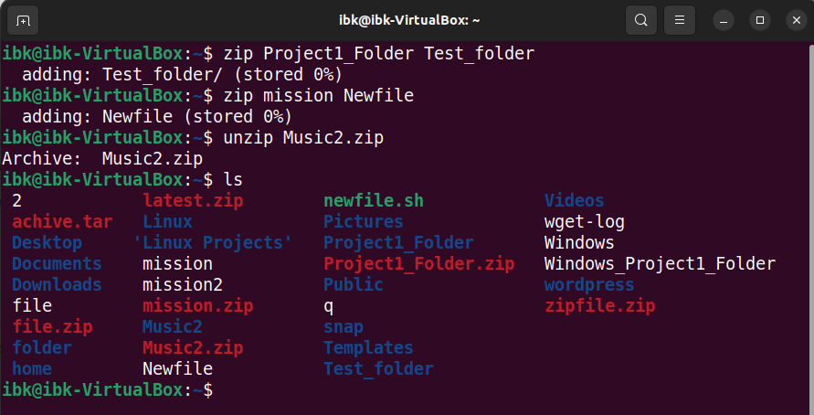

# LINUX PROJECT

## PROJECT HIGHLIGHT
1.	LINUX
2.	Introduction to linux
3.	What is Linux
4.	Importance of Linux
5.	Targeted Audience
6.	Prerequisite
7.	Goal to be accomplished by the end of the project
8.	Getting started with Linux
9.	Linux commands
10.	Concepts
11.	Best Practices
12.	Use cases
13.	Conclusion

## 1. Linux 
- Linux is a family of open-source Unix-like operating systems based on the Linux kernel, an operating system kernel first released on September 17, 1991, by Linus Torvalds.
Linux is also an open-source operating system for servers, computers, mainframes, mobile systems, and embedded systems.

### 2.Introduction to Linux 
- Linux is a family of free and open-source operating systems based on the Linux kernel. Operating systems based on Linux are known as Linux distributions or distros. Examples include Debian, Ubuntu, Fedora, CentOS, Gentoo, Arch Linux, and many others.
 Ref.google
there are 2 types of Linux, CLI & GUI

### 3 .What is Linux  
Linux is an open source operating system. As an operating system, Linux is software that sits underneath all of the other software on a computer, receiving requests from those programs and relaying these requests to the computer’s hardware

### 4 . Importance of Linux 
- Linux offers a greater degree of security than many operating systems
- Linux requires no antivirus programs for protection. It has self-protected means of blocking any form of virus.
- Open-source nature and flexibility -Linux is well known for being an open-source platform, which allows users to customize the system.
- Linux also offers a high degree of reliability, stability, requires little disk space. Linux has been a popular choice for server operating systems due to its outstanding reliability. It’s incredibly secure.
- Linux has powerful networking capabilitie and mputs software  updates in the hands of the user.
- Communitiy support and resources 
- Cost effectiveness compare to proprietary software.  

### Targeted Audience
Different Linux distribution have their targeted different users. Like Ubuntu, Debian,    
Fedora, CentOS, Gentoo Arch Linux, Kali Linux etc.
Developer user
System administrators
Cloud computing

### Prerequisite for Linux    
- Learner should have most basic of computer skills, such as knowing how to ON and OFF a   Computer and knowing how to use a mouse and keyboard, it also helps to know how to Navigate Internet and be able to do basic web searches with a search engine such as Yahoo or google.
- There should be willingness to learn this operating system
- Installation of Ubuntu for windows or MacOS, create user access
- Installation of Virtual Machine 

### Goal to be accomplished by the end of this project.
Learner should understand basic command line of operation.
- Learner should understand file management. 
- Learner should understand file directory navigation.
- Learner will understand users and permission management.
- Package installation and network configuration.
- Learner will be able to solve different problem by apply various knowledge acquired

GETTING STARTED WITH LINUX

### SUDO COMMAND
this is super user do, this is most popular command that allow learner to perform administrative task or root permission. While using sudo, sudo will ask for user authentication with password. It can be run with some flag  -g,-k-and -h and -r
run *sudo apt command*
udo apt command

### PWD COMMAND
The pwd command stands for print working directory.
run pwd  It has 2 acceptable options -L logic print & -p physical print 
*ibkcode@Sceptre:~$ pwd*
/home/ibkcode
ibk
    

### CD COMMAND
The cd command in Linux is used to change the current working directory in the terminal. cd-- moves one directory up and cd- moved to previos directory

### LS COMMAND
ls is a Linux shell command that lists directory contents of files and directories.It provides valuable information about files, There is some options with ls like -R -a -lh.

### CAT COMMAND
The name cat stands for concatenate, which means to join or link together.The cat command in Linux is a versatile tool that can be used to perform various file-related operations, such as viewing, creating, copying, merging, and manipulating files.
Type below command. To view a sigle file cat file_name
*cat [options] filename(s)*
*cat DevOps_training*

### TAC COMMAND
This read file contentnin reverse order, it can be used with -b, -s & -r flag. type below command tac file txt.

### CP COMMAND
the CP ommand in Linux is used to copy files and directories. It creates an exact image of a file on a disk with a different file name.The basic syntax for CP is cp source_file destination
*ibkcode@Sceptre:~/new_file$ cp Eo home/ibkcode/new_file*

### MV COMMAND
The mv command in Linux is a used to move files or directories from one location to another, or to rename files and directories within the same directory
The syntax mv [options (s)] [source_file_name (s)] [destination_file_name]
*ibkcode@Sceptre:~/2nd-Repository$ mv Lizy_doc Music*
*ibkcode@Sceptre:~/Music$ ls*
*Song  Songs  Tripplet*
*ibkcode@Sceptre:~/Music$ mv Song Lyrics*
*ibkcode@Sceptre:~/Music$ ls*
*Lyrics  Songs  Tripplet remane Songs folder to Lyrics*

### MKDIR COMMAND
This command is used to create one or multiple folder or directory at once.The user must have priviledge to create in a parent folder. The syntax command is mkdir [options] [directory_name(s)]
*ibkcode@Sceptre:~/Music$ mkdir Tripplet*

 ### RMDIR COMMAND
This command in Linux is used to remove empty directories from the file system. It is a simple and easy-to-understand command that only removes empty directories and does not work on directory with files. It can be used with flags like -p and -v rmdir <options> <directory>
*ibkcode@Sceptre:~/Music$ ls*
*Lyrics  Songs  Tripplet*
*ibkcode@Sceptre:~/Music$ rmdir Songs*
*ibkcode@Sceptre:~/Music$ ls*
*Lyrics  Tripplet*

### RM COMMAND 
This command is used to remove or delete files and directories in the Linux operating system. While at its core, the rm command is used to delete files and users cannot get the file again. Syntax $ rm a.txt.it has some acceptable options,-i,-f-r *ibkcode@Sceptre:~/ibk_folder/experiment$ rm menu*
*ibkcode@Sceptre:~/ibk_folder/experiment$ ls*
*'Is good to give what it takes to have your desire'*
*ibkcode@Sceptre:~/ibk_folder/experiment$*

### TOUCH COMMAND
This command is used either to modifying a timestamp and creating an empty file. the syntax is Touch{option} file...
*ibkcode@Sceptre:~/ibk_folder/experiment$ touch Desire*
*ibkcode@Sceptre:~/ibk_folder/experiment$ ls*
*Desire  'Is good to give what it takes to have your desire'*
*ibkcode@Sceptre:~/ibk_folder/experiment$*

### LOCATE COMMAND
This can be used to find files and directories and perform subsequent operations on them. The command searches for files by name, while the command searches for files by location.
User has to install lacate into their system
*locate [options] [pattern]*

### FIND COMMAND
To find file with a specific directory
*ibkcode@Sceptre:~$ find /home/ibkcode/music*
*/home/ibkcode/music*

### GREP COMMAND
This command is for string and pattern matching, allowing you to search through text files using various options. 
Enter below syntax *grep 'hello' file.txt*

### DF COMMAND
This is used to display the amount of disk space available on the file system containing each file name argument.There are some acceptable options options like -m, -h, -k
*ibkcode@Sceptre:~$ df -h*
Filesystem      Size  Used Avail Use% Mounted on
/dev/sdb        251G  1.3G  237G   1% /
none            1.9G  4.0K  1.9G   1% /mnt/wsl
tools           223G  165G   59G  74% /init
none            1.9G  4.0K  1.9G   1% /run
none            1.9G     0  1.9G   0% /run/lock
none            1.9G     0  1.9G   0% /run/shm
none            1.9G     0  1.9G   0% /run/user
tmpfs           1.9G     0  1.9G   0% /sys/fs/cgroup
drivers         223G  165G   59G  74% /usr/lib/wsl/drivers
lib             223G  165G   59G  74% /usr/lib/wsl/lib
drvfs           223G  165G   59G  74% /mnt/c
drvfs           477G   19G  459G   4% /mnt/d

### DU COMMAND
Open a terminal window and type du, followed by any options and files you want to check the disk usage of by a file or directory
DU stand for disk usage. Adding a flag to du will modify its operation. Flag like -m,-h -s.
*ibkcode@Sceptre:~$ du /home/ibkcode/2nd-Repository/ /home/**ibkcode/2nd-Repository/Music /home/ibkcode/2nd-Repository/.git/branche*

### HEAD COMMAND
This is used to see the first 10 line of a file. Is a Linux command that prints the first few lines of a file or a data stream. By default, it prints the first 10 lines of the file.
Enter this syntax *head -n 3 file.txt*

### TAIL COMMAND
This is used to display the last part of the file, By default, it prints the last ten lines of the input files. its useful for reading log file in real time
Enter this syntax *tail -n 5 file.txt*

### DIFF COMMAND
This command is used to compare 2 content of different file line by line, analyse them and display the diffence with their line. 
Enter this syntax *$ diff file1.txt file2.txt*

### TAR COMMAND
This command is used to create, extract and modify achive file
To create new achive *tar -cvf newachive.tar /home/ibkcode*

## FILE PERMISSION AND OWNERSHIP

### CHMOD COMMAND
This is uded to modify a file or directory read, write and execute permission. The command suppoer many options -v -s -c
Syntax chmod  permission 'filename' 

### CHOWN COMMAND
Chown Is used to change ownership of a file directory or link.
Enter this syntax chown [owner] file

### JOBS COMMAND
The jobs command will display all the running processes with their status
Enter syntax *jobID*

### KILL COMMAND
This is s built in command that can be used to terminate process manually.
Enter syntax kill [signal] PID
*ibkcode@Sceptre:~$ kill SIGKILL 16*

### PING COMMAND
The ping command allow Linux users to check the status of their internet connection and diagnosenetwork-related issues.   
Enter this syntax *ping [options] host_or_IP_address*

### WGET COMMAND
Wget is the non-interactive network downloader which is used to download files from the server even when the user has not logged on to the system and it can work in the background without hindering the current process.
Enter this command * wget option url*

### UNAME COMMAND
Uname command provides key details about your Linux system such as kernel version, operating system, hardware architecture, and more. It has some acceptable otions -a,-n and -s
*ibkcode@Sceptre:~$ uname -a*
*Linux Sceptre 5.10.16.3-microsoft-standard-WSL2 #1 SMP Fri Apr 2 22:23:49 UTC 2021 x86_64 x86_64 x86_64 GNU/Linux*
ibkcode@Sceptre:~$

### TOP COMMAND
is used to show the Linux processes. It provides a dynamic real-time view of the running system. IT provide total summary information of the system and the list of processes or threads which are currently managed by the Linux Kernel.
Enter this syntax  *top*
*top - 20:43:34 up 1 day, 16:03,  0 users,  load average: 0.00, 0.00, 0.00*
*Tasks:  14 total,   1 running,  13 sleeping,   0 stopped,   0 zombie*
%Cpu(s):  0.0 us,  0.1 sy,  0.0 ni, 99.9 id,  0.0 wa,  0.0 hi,  0.0 si,  0.0 st
MiB Mem :   3879.3 total,   3736.8 free,     79.8 used,     62.8 buff/cache
MiB Swap:   1024.0 total,   1024.0 free,      0.0 used.   3655.0 avail Mem

  PID USER      PR  NI    VIRT    RES    SHR S  %CPU  %MEM     TIME+ COMMAND                                                               
  191 ibkcode   20   0    7776   3672   3108 R   0.0   0.1   0:00.85 top  

### HISTORY COMMAND
History command is a useful command-line tool that shows a record of all the commands entered by the user during the current shell session 
Enter this command *history [option]*
ibkcode@Sceptre:~$ history  1  sudo apt update && sudo apt upgrade
    2  sudo
    3  sudo apt update && sudo apt upgraderm
    4  sudo
    5  sudo apt update && sudo apt upgrade
    6  sudo
    7  sudo apt update && sudo apt upgrade
    8  ibkaycode1
    9  sudo apt update && sudo apt upgrade
   10  ls
   11  pwd
   12  sudo
   13  sudo apt upgrada
   14  ibkcode1
   15  sudo apt upgrade
   16  -k
   17  pwd
   18  cd command Linus
   19  cd commandlinus
   20  cd CommandsLinus
   21  ls
   22  ls /home/ubuntu
   23  ld -a
   24  ls -lh
   25  cat sqlite_commands.sh
   26  mkdir music/song
   27  cd music
   28  mkdir -m777 music
   29  mkdir Music
   30  ls
   31  mkdir Music/Song

   ### MAN COMMAND
This is used to display the user manual of any command that can be run on the terminal. 
Enter this syntax man ls, man2 ls
 LS(1)                                                     
 User Commands                                                   
  LS(1)

NAME
ls - list directory contents

SYNOPSIS     * ls [OPTION]... [FILE]...*

### ECHO COMMAND
This is a built-in feature in Linux that prints out arguments as the standard output. It is commonly used to display text strings or command results as messages.
The syntax for the echo command is: echo [option] [string]
ibkcode@Sceptre:~$ *echo 'hello world'*

hello world
ibkcode@Sceptre:~$

### ZIP, UNZIP COMMAND
The zip command is used to create compressed archives of one or more files or directories
The zip command is used t archives of one or more files or directories
Enter this syntax *zip option zipfile file1 file2*
*ibkcode@Sceptre:~$ zip zipfile Eo Dan_file*

### HOSTNAME COMMAND
The hostname command in Linux is used to obtain and set the system's hostname and domain name.
Enter this syntax hostname options
*ibkcode@Sceptre:~$ hostname -i*
127.0.1.1
ibkcode@Sceptre:~$

### USERADD, USERDEL COMMAND
Useradd command is used to create new users or update user information such as setting a user’s home directory, password, and other settings
*Enter syntax useradd [OPTIONS] USERNAME*
*Userdel is used to delete user account on related file8
*Enter this syntax userdel [OPTIONS] USERNAME8
*ibkcode@Sceptre:~$ useradd Dan*

### APT-GET COMMAND
apt-get is a command-line tool that helps in handling packages in Linux. Its main task is to retrieve the information and packages from the authenticated sources for installation, upgrade, and removal of packages along with their dependencies.
*Enter below command, running this involve sido root access.*
*apt-get  press enter *
*ibkcode@Sceptre:~$ apt-get*
apt 2.4.11 (amd64)
Usage: apt-get [options] comman 
apt-get [options] install|remove pkg1 [pkg2 ...  
apt-get [options] source pkg1 [pkg2 ..

### NANO, VI JED COMMAND
Nano is a simple and easy-to-use text editor such as syntax highlighting, search and replace, spell checks 
Vi is a simple and easy-to-use text editor suchcustomizable and includes advanced features such as macros, regular expressions, and more.
Jed is lightweight and easy to use, making it a good choice for quick edits. It includes basic functionality such as syntax highlighting, search and replace, and more 
Netrw Directory Listing                                        (netrw v17 
"   /home/ibkcode/ibk_folder/experiment
Sorted by      name
"   Sort sequence: [\/]$,\<core\%(\.\d\+\)\=\>,\.h$,\.c$,\.cpp$,\~\=\*$,*,\.o$,\.obj$,\.info$,\.swp$,\.bak$,\~$
"   Quick Help: <F1>:help  -:go up dir  D:delete  R:rename  s:sort-by  x:special

### ALAIS AND UNALIAS COMMAND
Aliases are mostly used to replace long commands, improving efficiency and avoiding potential spelling errors while 
The unalias command removes the definition for each alias name specified, or removes all alias definitions if the -a flag is used. Enter below command

*Alias D=dollar*
*Unalias D*

### SU COMMAND
SU user or to switch user is used to run program as a different users

### HTOP COMMAND
CThis command line system monitor htop is an interactive system monitor process viewer and process manager.
*Enter syntax htop* 

ibkcode@Sceptre:~$ htop -C

### PS COMMAND
The ps command in Linux is used to list the currently running processes and their PIDs along with some other information, which depends on different options  
Enter syntax ps option

## CONCLUSION
Linux has evolved into one of the most reliable computer ecosystems on the planet. Combine that reliability with zero cost of entry and you have the perfect solution for a desktop platform.

[def]: <Image/cd command.png>